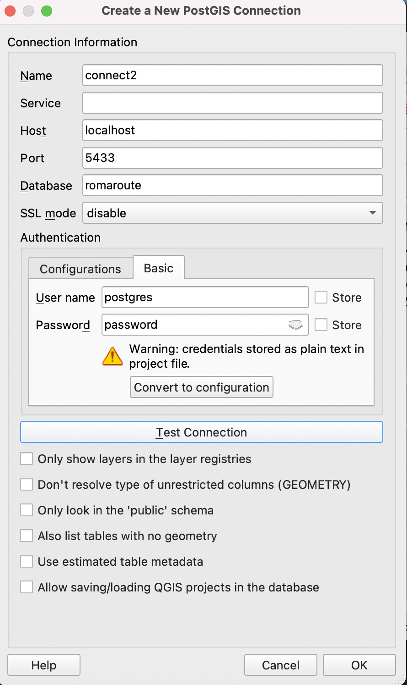

### Roma Graph Instructions

### DATABASE

After cloning the repo

1. create your branch (avoid local change)

```git checkout -b mylocal```

2. change into src

```cd src```

2. build and run the image

```docker-compose up --build -d```

3. wait until it finish without error, and now run the creation of the graph

```docker-compose exec pgrout bash```

4. you are now inside the container, run the scripts, to do so

```cd scripts```

```./downloadAndConvert.sh```

What does the scripts do?

	- download the osm data
	- convert it into osm
	- create a database named *romaroute*
	- populate the database with a graph using [prgouting](https://pgrouting.org/)

wait until it finishes

### QGIS

1. create a new postgresql connection

choose any name you want, leave empty the service,
- host : localhost
- port : 5433
- dbname : romaroute

>>> basic authentification

	- username : postgres
	- paswword : password


Notice: I choose port to 5433 because you might have postgres sefrver running on your computer running on 5432.




	
